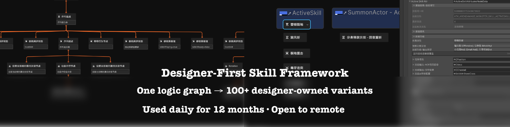

# Designer-First Skill Framework
**Zero code duplication · 100+ skill variants fully owned by designers**

[](https://www.youtube.com/watch?v=h6gxAE1EmuE)
**4-minute uncut live demo**  
→ Duplicate one data row → tweak 4 values → new skill instantly works  
→ No graph duplication · No new script · Zero engineer bottleneck

Used daily for 12 months of full-team Steam development.
Try the exact workflow right now (20 seconds):  
Open `Scenes/ShowcaseScene.unity` → Play

### Real Impact
- Engineers build archetype graphs **once**
- Designers own all variants **forever**
- Measured output when I wore both hats: **25–40 balanced variants/day**  
  (vs. 4–6 with traditional copy-paste workflow)

---

## Project Overview

This project is a **production-ready, modular skill system** extracted from an in-development Steam game. It demonstrates a **data-driven architecture** where skill data is strictly separated from runtime logic.

**The Core Philosophy:**
1.  **Designer Autonomy**: Designers should be able to create, tweak, and test skill variants without writing a single line of code.
2.  **Zero Duplication**: Logic is written once in generic processors; data defines the specific behavior.
3.  **Performance**: Visual graphs are compiled into compact binary data (`.bytes`) for zero-parsing runtime loading.

## Folder Structure

*   `Assets/Scripts/DataCtrl`: Contains the data definitions and serialization logic.
    *   `NPData`: Node Processor Data, including `ICommonAttributeBase` and specific attribute types.
    *   `DataScriptableObject`: Global config (`GlobalGameConfig`), scene load config, etc.
    *   `ResourceLoader`: Unified resource loader (Resources/Addressables) with `ResourceAssetType` folder mapping.
*   `Assets/Scripts/Core`: The core runtime game logic that consumes the data.
*   `Assets/Scripts/Manager`: Game client lifecycle (`GameClientManager`), entry (`GamePlayEntry`), scene managers.
*   `Assets/Scripts/GamePlay`: Room manager, input routing, etc.
*   `Assets/Plugins/NodeEditor`: The visual graph editor tool (based on `NodeGraphProcessor`).
*   `Assets/Scenes`: Demo scenes (e.g., `ShowcaseScene.unity`) to test the workflow.

## Workflows

### Designer Workflow (No Code)
1.  **Open Graph**: Navigate to `Assets/Resources/SkillData` and open a `AllSkillAttributesDataGraph`.
2.  **Create/Edit**:
    *   **New Variant**: Duplicate an existing node group.
    *   **Tweak**: Adjust values (damage, range, cooldown) in the inspector.
3.  **Compile**: Click the **"OneKeySet"** button in the graph toolbar. This serializes the graph to binary.
4.  **Play**: Run the game. The new data is instantly live.

### Engineer Workflow
1.  **Define Data**: Create a new class implementing `ICommonAttributeBase` if a new attribute type is needed.
2.  **Implement Logic**: Write the runtime logic in `Assets/Scripts/Core` to handle the new attribute.
3.  **Expose**: The system uses reflection to automatically expose new data types to the graph editor.

## Technical Highlights

*   **Visual Data Editor**: Built on top of `NodeGraphProcessor`, allowing for a node-based visual scripting environment tailored for data.
*   **Binary Serialization**: Uses `MongoDB.Bson` for high-performance, type-safe binary serialization. This ensures that complex polymorphic data structures are saved and loaded efficiently.
*   **Polymorphic Data**: The system handles nested and polymorphic data types naturally, allowing for extensible skill attributes without custom parsers.

## Testing (Edit Mode)

We use **Unity Test Framework** for edit-mode coverage.

- **Test Runner**: `Window → General → Test Runner` → `Edit Mode` tab → select `EditModeTests` → Run All.
- **Command line (example)**:
  ```
  /Applications/Unity/Hub/Editor/<UNITY_VERSION>/Unity \
    -batchmode -projectPath /Users/domi/SoulMaster/Modular-Skill-System-Demo \
    -runTests -testPlatform editmode \
    -testResults /tmp/editmode-results.xml \
    -quit
  ```
  Replace `<UNITY_VERSION>` with your installed Unity version.

### Role ID generation rules
- Role key format: `Profession_Side_Model_Sprite_Name`.
- Empty Sprite/Name use fallbacks: `UnknownSprite` / `Unnamed`.
- ID is read-only in the Inspector; use the **Generate Role ID** button to update it.

### Startup & resource loading
- Global config: `Assets/Resources/ScriptableObject/GlobalGameConfig.asset` selects load mode (Resources/Addressables).
- Entry: `GamePlayEntry` initializes `GlobalServices` and switches to the initial scene manager (defaults to `ShowCaseSceneManager` asset).
- Resource loader: `ResourceLoader` builds paths from `ResourceAssetType` (e.g., `ScriptableObject/{name}`, `UI/{name}`, `Models/Hero/{name}`, `AllCharacterData/{name}`) in Resources mode; in Addressables mode it uses the asset name as key.
- Addressables: requires `ADDRESSABLES_AVAILABLE` compile symbol; otherwise Addressables loads return null with a warning.
- Scene content: `SceneLoadConfig` drives data-only scene loading; scene managers use the loader for all assets.

### Not yet covered
- Play Mode tests (runtime/asset loading, prefab behaviors)
- Resource loading paths and failure handling
- Full asset export/import pipeline (beyond edit-mode serialization tests)

---

## About Ebonor (context)

- **Ebonor** is my in-development Steam action roguelite project.  
- This skill framework was used daily for about a year to build and balance skills.
- The project is **currently paused before public playtest**:
  - After building a near-vertical-slice, I reassessed the commercial risk of
    shipping a large-scale solo game in today’s AI-accelerated market.
    Tools like GenAI are rapidly lowering content production costs,
    which makes strong systems, tooling and team execution even more important.
  - I decided to pause the public release plan, extract the most reusable systems
    (like this skill framework), and focus on bringing this experience into a team.

Steam store page (for context and screenshots):  
<https://store.steampowered.com/app/3680960/Ebonor/>

---
