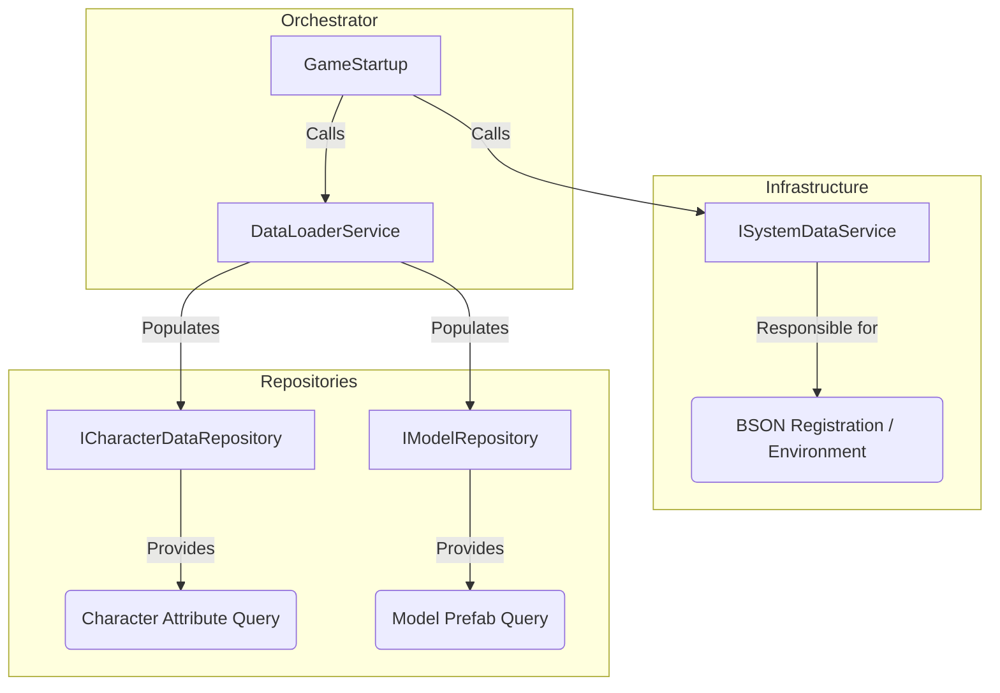

# DataCtrl Refactoring Analysis & Plan

## 1. Current State Analysis

The current `DataCtrl` assumes at least **3 completely different** responsibilities:

1.  **System Initialization**:
    *   Responsible for BSON serialization library registration (`LoadAllSystemDataAsync`, `OnLoadMPBattleGraphData`).
    *   This is "Infrastructure" level work.
2.  **Data Repository**:
    *   Stores character attribute data (`_dicUnitAttriDatas`).
    *   Stores model prefab references (`_dicGameModel`).
    *   This is "Data Storage" level work.
3.  **Resource Loading Logic**:
    *   Responsible for calling `GlobalServices.ResourceLoader` to load files.
    *   Responsible for parsing BSON binary streams.
    *   This is "Business Logic" level work.

**Issues**:
*   **Violates Single Responsibility Principle (SRP)**: Changing BSON registration requires modifying it; changing character data structure requires modifying it; changing resource loading method also requires modifying it.
*   **Hard to Test**: To test "get character attributes" logic, you must run through complex resource loading first.
*   **Singleton Coupling**: The entire project depends on `DataCtrl.Inst`, making it hard to replace the implementation.

---

## 2. Refactoring Plan: Divide and Conquer

We will not modify `DataCtrl` directly, but create a **new service system** to replace it.

### Architecture Diagram

### 3. Execution Steps

We adopt a **"Parallel Change"** strategy to avoid breaking existing code.

#### Step 1: Define Contracts
Create in `Scripts/Core/Interfaces/`:
*   `ISystemDataService`: Responsible for `LoadAllSystemDataAsync` (BSON registration).
*   `ICharacterDataRepository`: Responsible for `GetUnitAttributeNodeData`.
*   `IModelRepository`: Responsible for `OnGetModel`.

#### Step 2: Implementation
Create in `Scripts/DataCtrl/Services/`:
*   `SystemDataService`: Implements BSON registration logic.
*   `CharacterDataRepository`: Pure C# class, only stores dictionaries, not responsible for loading.
*   `ModelRepository`: Pure C# class, only stores model dictionaries.
*   **`DataLoaderService`**: A new role. It is responsible for reading data from `ResourceLoader` and then **Populating** the two Repositories above.

#### Step 3: Binding & Replacement
1.  Bind these new services in `GlobalInstaller`.
2.  Modify `GameStartup` to call `DataLoaderService` to load data.
3.  (Finally) Change all places in the project that call `DataCtrl.Inst` to inject the corresponding Interface.

---

## 4. Your Decision

This plan will create about 4-5 new files, but will make the architecture extremely clear.
*   **SystemDataService** only cares about BSON.
*   **Repository** only cares about storing/retrieving data (like a database).
*   **DataLoader** only cares about moving data.

**Do you adopt this plan?** If agreed, I will start creating interfaces.
