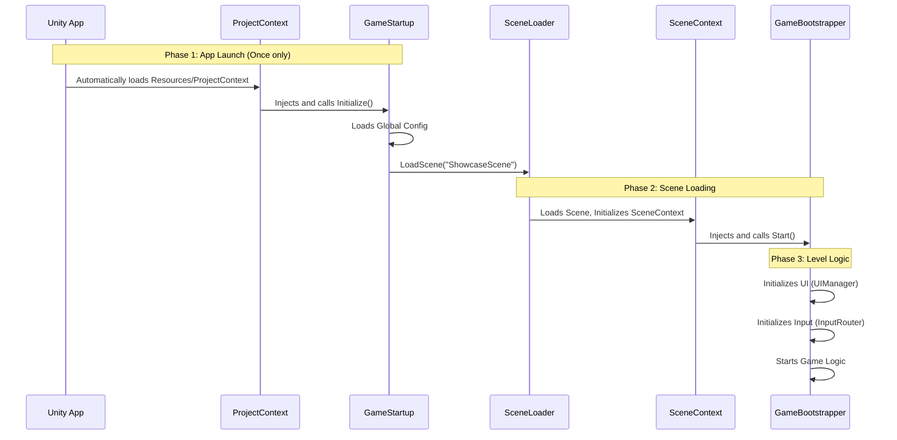

# Architecture Clarification: GameStartup vs GameBootstrapper

It is completely normal to feel confused. During our refactoring, we introduced two "starters", and their responsibilities do seem to overlap.

Let's clarify their relationship with a diagram.

## 1. Core Difference: Scope

| Component | GameStartup | GameBootstrapper |
| :--- | :--- | :--- |
| **Container** | **ProjectContext** (Global) | **SceneContext** (Scene) |
| **Lifecycle** | Runs **ONCE** at game launch | Runs **EVERY TIME** a scene loads |
| **Survival** | Persists permanently (DontDestroyOnLoad) | Destroyed with the scene |
| **Role** | **"Application Launcher"** | **"Level Manager"** |
| **Analogy** | Computer Power Button (BIOS) | Opening a Word Document |

---

## 2. Startup Flow Diagram

---

## 3. Detailed Responsibilities

### GameStartup (Global Manager)
*   **It only cares about**:
    1.  Initializing global services (Network, Config, Resource Loader).
    2.  Deciding **where the first scene is** (Login page? Or directly to Demo?).
*   **Code Characteristic**: It is a pure C# class (`IInitializable`), not a `MonoBehaviour`.

### GameBootstrapper (Local Leader)
*   **It only cares about**:
    1.  What UI does the **current scene** need? (Showcase needs HealthBar, Login needs InputField).
    2.  Where to spawn the character in the **current scene**?
    3.  How to handle input in the **current scene**?
*   **Code Characteristic**: It is a `MonoBehaviour` because it might need to reference objects in the scene (like SpawnPoint).

---

## 4. Why do we need two?

If you only had `GameBootstrapper`:
*   When you switch from "Main Menu" to "Battle Scene", `GameBootstrapper` gets destroyed.
*   What happens to your "Global Config" and "Network Connection"? Do you reconnect every time?
*   **So we need GameStartup**: It acts like a **backpack**, carrying things that shouldn't be lost across scene boundaries.

## 5. Current Status & Suggestions

Currently, your `GameBootstrapper` still retains some global logic (like `DataCtrl.LoadAllSystemDataAsync`).

**Best Practice Refactoring Direction**:
1.  Move `DataCtrl` loading logic to `GameStartup` (or let DataCtrl initialize itself in ProjectContext).
2.  Make `GameBootstrapper` purer: only handle UI and Input.

But to avoid taking too big a step, **keeping the status quo is fine for now**.
You can view `GameStartup` simply as a "tool to help you load the first scene".
