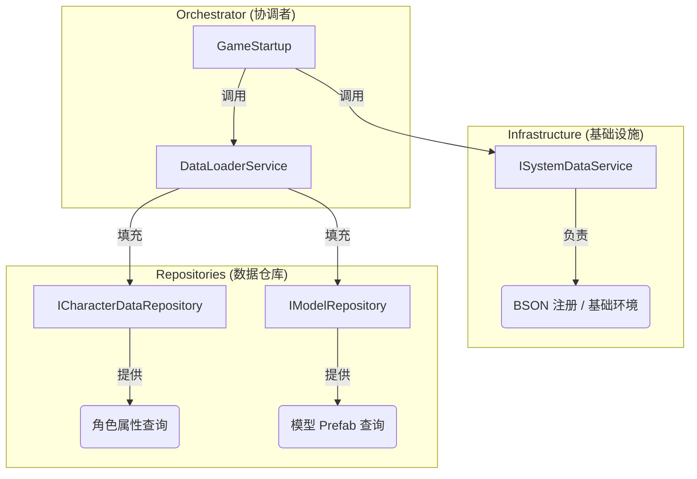

# DataCtrl 重构分析与方案

## 1. 现状分析 (Current State)

目前的 `DataCtrl` 至少承担了 **3 种完全不同** 的职责：

1.  **系统初始化 (System Initialization)**：
    *   负责 BSON 序列化库的注册 (`LoadAllSystemDataAsync`, `OnLoadMPBattleGraphData`)。
    *   这是“基础设施”层面的工作。
2.  **数据仓库 (Data Repository)**：
    *   存储角色属性数据 (`_dicUnitAttriDatas`)。
    *   存储模型预制体引用 (`_dicGameModel`)。
    *   这是“数据存储”层面的工作。
3.  **资源加载逻辑 (Resource Loading Logic)**：
    *   负责调用 `GlobalServices.ResourceLoader` 去加载文件。
    *   负责解析 BSON 二进制流。
    *   这是“业务逻辑”层面的工作。

**问题**：
*   **违反单一职责原则 (SRP)**：修改 BSON 注册逻辑要改它，修改角色数据结构要改它，修改资源加载方式也要改它。
*   **难以测试**：想测试“获取角色属性”的逻辑，必须先跑一遍复杂的资源加载。
*   **单例耦合**：全项目都依赖 `DataCtrl.Inst`，导致无法轻易替换实现。

---

## 2. 重构方案：拆分与解耦 (Divide and Conquer)

我们不直接修改 `DataCtrl`，而是创建一套 **新的服务体系** 来替代它。

### 架构设计图

### 3. 具体执行步骤

我们采用 **"Parallel Change" (并行修改)** 策略，不破坏现有代码。

#### Step 1: 定义接口 (Contracts)
在 `Scripts/Core/Interfaces/` 下创建：
*   `ISystemDataService`: 负责 `LoadAllSystemDataAsync` (BSON 注册)。
*   `ICharacterDataRepository`: 负责 `GetUnitAttributeNodeData`。
*   `IModelRepository`: 负责 `OnGetModel`。

#### Step 2: 实现服务 (Implementation)
在 `Scripts/DataCtrl/Services/` 下创建：
*   `SystemDataService`: 实现 BSON 注册逻辑。
*   `CharacterDataRepository`: 纯粹的 C# 类，只存字典，不负责加载。
*   `ModelRepository`: 纯粹的 C# 类，只存模型字典。
*   **`DataLoaderService`**: 这是一个新角色。它负责从 `ResourceLoader` 读取数据，然后 **填充 (Populate)** 到上面两个 Repository 里。

#### Step 3: 绑定与替换
1.  在 `GlobalInstaller` 里绑定这些新服务。
2.  修改 `GameStartup`，让它调用 `DataLoaderService` 来加载数据。
3.  (最终) 把项目中所有调用 `DataCtrl.Inst` 的地方，改为注入对应的 Interface。

---

## 4. 你的决定

这个方案会创建约 4-5 个新文件，但会让架构变得极其清晰。
*   **SystemDataService** 只管 BSON。
*   **Repository** 只管存取数据（像数据库一样）。
*   **DataLoader** 只管搬运数据。

**是否采用此方案？** 如果同意，我将开始创建接口。
