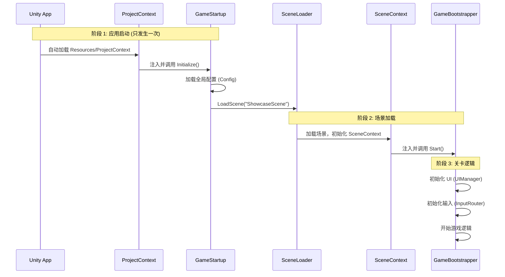

# 架构解惑：GameStartup vs GameBootstrapper

你感到晕是非常正常的。因为我们在重构过程中引入了两个“启动器”，它们的职责看起来确实有重叠。

让我们用一张图彻底理清它们的关系。

## 1. 核心区别：作用域 (Scope)

| 组件 | GameStartup | GameBootstrapper |
| :--- | :--- | :--- |
| **所属容器** | **ProjectContext** (全局) | **SceneContext** (场景) |
| **生命周期** | 游戏启动时运行 **1次** | **每次** 加载场景都会运行 |
| **存活时间** | 永久存活 (DontDestroyOnLoad) | 随场景销毁 |
| **职责** | **"应用启动器"** | **"关卡管理器"** |
| **类比** | 电脑的开机键 (BIOS) | 打开一个 Word 文档 |

---

## 2. 启动流程图 (The Flow)

---

## 3. 详细分工

### GameStartup (全局总管)
*   **它只关心**：
    1.  初始化全局服务（网络、配置、资源加载器）。
    2.  决定**第一个场景**去哪里（是去登录页？还是直接进 Demo？）。
*   **代码特征**：它是一个纯 C# 类 (`IInitializable`)，没有 `MonoBehaviour`。

### GameBootstrapper (地头蛇)
*   **它只关心**：
    1.  **当前场景** 需要什么 UI？(Showcase 场景需要血条，登录场景需要输入框)。
    2.  **当前场景** 的角色在哪里生成？
    3.  **当前场景** 的输入怎么处理？
*   **代码特征**：它是一个 `MonoBehaviour`，因为它可能需要拖拽场景里的物体（比如 SpawnPoint）。

---

## 4. 为什么需要两个？

如果你只有一个 `GameBootstrapper`：
*   当你从“主菜单”切换到“战斗场景”时，`GameBootstrapper` 会被销毁。
*   那你存在里面的“全局配置”和“网络连接”怎么办？难道要重新连接一次？
*   **所以我们需要 GameStartup**：它像一个**背包**，背着那些不能丢的东西，跨越场景的边界。

## 5. 你的现状与建议

目前你的 `GameBootstrapper` 里还保留了一些全局逻辑（比如 `DataCtrl.LoadAllSystemDataAsync`）。

**最佳实践重构方向**：
1.  把 `DataCtrl` 的加载逻辑移到 `GameStartup` 里（或者让 DataCtrl 自己在 ProjectContext 里初始化）。
2.  让 `GameBootstrapper` 变得更纯粹：只管 UI 和 Input。

但为了不步子迈太大，**现在保持现状是可以的**。
你可以把 `GameStartup` 仅仅看作是“帮你加载第一个场景的工具人”。
